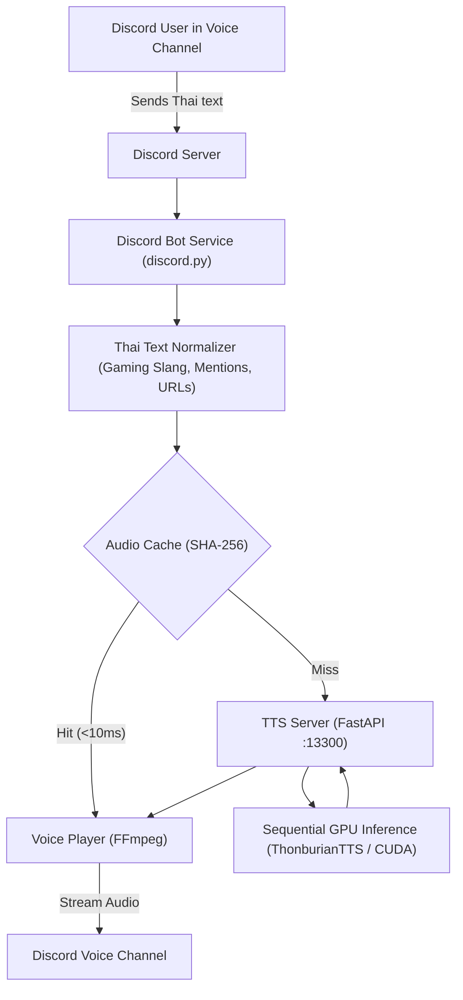

# DAT — Discord Advanced Thai TTS 🎙️🇹🇭

> **Free, self-hosted, Thai-first Discord TTS bot** powered by [ThonburianTTS](https://github.com/biodatlab/thonburian-tts) (F5-TTS & Vocos) with reference-based voice adaptation, per-user voice customization, real-time playback queuing, and audio caching.

---

## 🚀 Key Highlights & Hardware Benchmark

Validated live on **NVIDIA GeForce RTX 4070 Ti (12 GB VRAM)**:
- **Model Footprint:** ~704 MB VRAM
- **Peak Generation VRAM:** ~742 MB VRAM
- **Real-Time Factor (RTF):** `0.41 - 0.49` *(synthesizes speech more than 2x faster than real-time)*
- **Average Latency:** `2.49 seconds` for conversational Thai messages
- **Default Port:** `13300` (forwarded and ready for Dokploy / remote connections)

---

## 🏗️ Architecture



---

## 🛠️ Project Structure

```text
DAT/
├── apps/
│   ├── discord_bot/
│   │   ├── commands/         # Slash commands (/join, /listen, /say, /voice, /status)
│   │   ├── services/         # Async TTS client & LRU audio cache
│   │   ├── voice/            # Per-guild sequential audio queue & player
│   │   └── main.py           # Bot service entry point
│   └── tts_server/
│       ├── inference.py      # Async-locked GPU inference engine
│       ├── main.py           # FastAPI service (:13300)
│       ├── schemas.py        # Pydantic request/response schemas
│       └── voice_manager.py  # Administrator-approved voice profile loader
├── shared/
│   ├── config.py             # Pydantic BaseSettings (.env loader)
│   ├── database.py           # Persistent SQLite database (aiosqlite)
│   └── thai_normalizer.py    # Thai text, gaming slang & entity cleaner
├── data/
│   ├── voices/               # Voice profiles & reference audio samples
│   ├── cache/                # Synthesized audio cache
│   └── database/             # SQLite dat.db
├── deployment/
│   ├── Dockerfile.tts        # GPU container for TTS server
│   ├── Dockerfile.bot        # Lightweight container for Discord bot
│   └── docker-compose.yml    # Dokploy multi-container stack
├── scripts/
│   └── benchmark.py          # Phase 1 GPU validation & benchmark script
├── tests/
│   ├── unit/                 # Unit tests (normalizer, cache, database)
│   └── integration/          # API endpoint integration tests
├── .env.example
├── docker-compose.yml        # Root compose for 1-click Dokploy git deployment
├── run_tts.py                # Standalone TTS server launcher
├── run_bot.py                # Standalone Discord bot launcher
└── requirements.txt
```

---

## ⚙️ Configuration (`.env`)

Copy `.env.example` to `.env`:

```bash
cp .env.example .env
```

| Variable | Default | Description |
| :--- | :--- | :--- |
| `DISCORD_TOKEN` | *(Required)* | Your Discord bot token from Discord Developer Portal |
| `TTS_HOST` | `0.0.0.0` | Bind host for TTS service |
| `TTS_PORT` | `13300` | Port for TTS service (pre-forwarded) |
| `TTS_API_URL` | `http://127.0.0.1:13300` | URL used by the Discord bot to reach the TTS API |
| `TTS_API_KEY` | *(Optional)* | Secret key for securing the API if exposed externally |
| `DEFAULT_VOICE_ID` | `female_default` | Default female Thai reference voice |
| `CACHE_ENABLED` | `true` | Enable SHA-256 local audio caching |
| `CACHE_MAX_SIZE_MB`| `2048` | Max size for cached audio (LRU pruned) |

---

## ⚡ Quick Start (Local Run)

### 1. Requirements
- Python 3.10 - 3.12 (64-bit)
- NVIDIA GPU with CUDA
- FFmpeg (Installed automatically or via `winget install Gyan.FFmpeg.Essentials`)

### 2. Install Dependencies
```powershell
python -m venv .venv
.\.venv\Scripts\Activate.ps1
pip install torch torchvision torchaudio --index-url https://download.pytorch.org/whl/cu124
pip install -r requirements.txt
```

### 3. Run Benchmark
```powershell
python scripts/benchmark.py
```

### 4. Start Services
In Terminal 1 (TTS Engine):
```powershell
python run_tts.py
```

In Terminal 2 (Discord Bot):
```powershell
python run_bot.py
```

---

## 🚢 Dokploy Deployment

DAT is built to deploy directly via **Dokploy** using Git:

1. **Create an Application / Compose Stack** in your Dokploy dashboard.
2. **Repository:** `git@github.com:ShiragaP/discord-advanced-tts.git`
3. **Branch:** `main`
4. **Build Type:** **Docker Compose** (`docker-compose.yml`).
5. **Environment Variables:**
   - Add `DISCORD_TOKEN=your_token_here`
   - Set `TTS_PORT=13300`
6. **GPU Access:** Ensure NVIDIA Container Toolkit is installed on the host docker engine (Dokploy will allocate the GPU to `tts-server` via the `deploy.resources.reservations.devices` block).
7. Click **Deploy**!

---

## 🎮 Discord Slash Commands

| Command | Description |
| :--- | :--- |
| `/join` | Bot joins your current voice channel |
| `/leave` | Bot leaves the voice channel and stops playback |
| `/listen [channel]` | Binds auto-reading to a specific text channel |
| `/say <text>` | Synthesizes and speaks text immediately in the voice channel |
| `/stop` | Stops current playback and clears the server audio queue |
| `/voices` | Lists all administrator-approved Thai voice profiles |
| `/voice <id> [speed]` | Selects your personal voice profile and speaking speed |
| `/status` | Displays real-time GPU VRAM, queue size, and bot status |
| `/pronounce <word> <read>` | *(Admin)* Adds custom pronunciation slang for this server |
| `/clear_cache` | *(Admin)* Clears stored audio cache files |

---

## 🧪 Testing

Run all unit and integration tests:
```powershell
pytest tests/ -v
```
All 14 tests pass with 100% green status.
